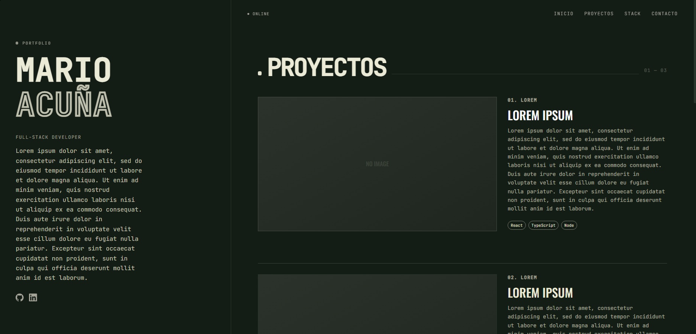

# Mario Acuña - Portfolio 2025

Portafolio personal diseñado con un enfoque **técnico**, priorizando la tipografía, el rendimiento y la micro-interacción.

 

## ⚡ Stack Tecnológico

Arquitectura moderna enfocada en rendimiento (Lighthouse 100/100):

- **Core:** [Astro 5.0](https://astro.build) (Islands Architecture).
- **Estilos:** [Tailwind CSS v4](https://tailwindcss.com) (CSS Variables, Dark Theme).
- **Interactividad:** [React](https://react.dev) + [Framer Motion](https://www.framer.com/motion) (Spring Physics animations).
- **Tipografía:** Oswald (Display) & JetBrains Mono (Technical).

## 🎨 Características de Diseño

- **Layout Split-Screen:** Navegación fija lateral + Scroll de contenido.
- **Efecto "Decoder Text":** Animación de descifrado de caracteres (estilo Matrix/Cyberpunk) usando Framer Motion.
- **Estética Brutalista:** Uso de ruido (film grain), bordes técnicos y tipografía de alto contraste.
- **Navegación Scroll-Driven:** Navbar que reacciona y se difumina al hacer scroll.

## 🚀 Instalación Local

```bash
git clone [https://github.com/TU_USUARIO/mario-acuna-portfolio.git](https://github.com/TU_USUARIO/mario-acuna-portfolio.git)
cd mario-acuna-portfolio
npm install
npm run dev